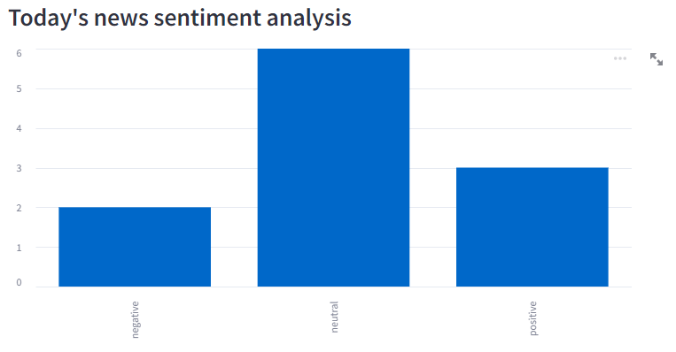
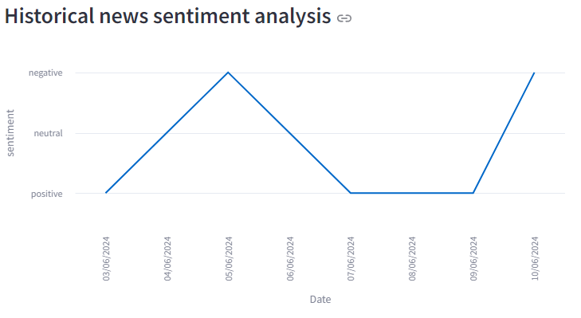

# Bitcoin News Sentiment Analysis

Sentiment analysis for Bitcoin news from Bitcoin.com




## Requirements

To run this project, you will need Python 3.11 installed on your machine. This guide is tailored for Windows users.

## Installation

1. Clone this repository to your local machine:

   ```bash
   git clone https://github.com/MaximeBonnel/Bitcoin-news-sentiment-analysis.git
   ```

2. Navigate to the project directory:

   ```bash
   cd Bitcoin-news-sentiment-analysis
   ```

3. Install the required libraries:

   ```bash
   pip install -r requirements.txt
   ```

> You can also setup the environnement with the conda file "condaEnv.yml".

## Run the Project

To run the sentiment analysis application, execute the following command:

   ```bash
   streamlit run main.py
   ```

## License

This project is licensed under the MIT License. See the [LICENSE](LICENSE) file for details.

#

##### By Maxime